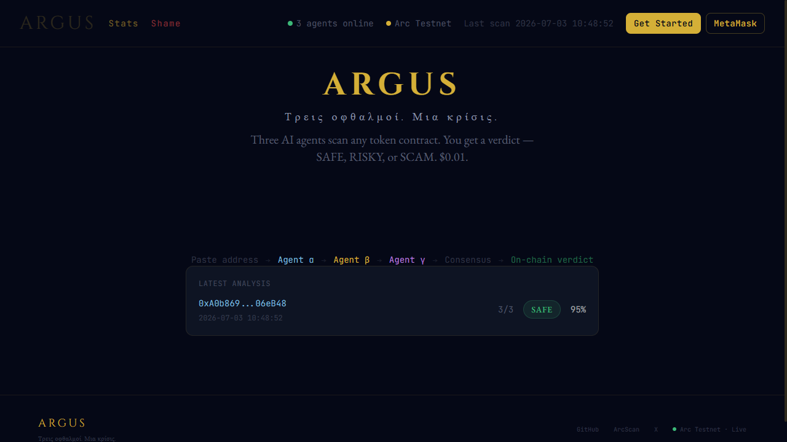
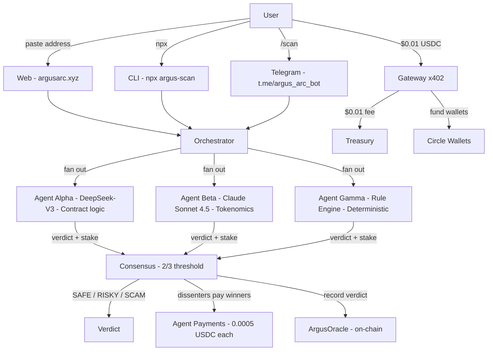

# Argus

<p align="center">
  <a href="https://argusarc.xyz">
    
  </a>
  <a href="https://x.com/Argus_arc">
    
  </a>
  <a href="https://testnet.arcscan.app/address/0x0699a029e2e05EC88d6418EC744232702Cf77d81">
    
  </a>
  <a href="https://testnet.arcscan.app/address/0x4Dd5e289168ddb28f9b34134EAbccAF373eb64Cb">
    
  </a>
  <a href="https://testnet.arcscan.app/address/0x563b2DA572948C2b54B5f1f26CcFebC153Cb46C8">
    
  </a>
  <br>
  <a href="https://testnet.arcscan.app/address/0x284e38e6f139b3b85c746e00f8a3cf46d2b2d320">
    
  </a>
  <a href="https://testnet.arcscan.app/address/0x3f752a72d8e2d9d3a4f2011ca9e0407bc5b7a34f">
    
  </a>
  <a href="https://testnet.arcscan.app/address/0x1fa79f59abbada269de477b45ded38c75a6146de">
    
  </a>
  <a href="https://www.npmjs.com/package/argus-scan">
    
  </a>
  <a href="https://argus-agent-production-ab97.up.railway.app/health">
    
  </a>
</p>

**Τρεις οφθαλμοί. Μια κρίσις.** — Three eyes. One verdict.



> **Don't get rugged.** Three independent agents analyze any token. Each stakes real USDC on its verdict. When they disagree, the losers pay the winners — real money moves between agents on every scan. 2/3 consensus. Full reasoning from every agent.
>
> **For creators.** Token launches need security. Audits cost $5K. Argus costs $0.01. A Distribution Bootstrap security sidecar — any creator, any DAO, any trader. No MetaMask required. Works on mobile. Every verdict on-chain forever.

| **924 scans** | **$9.60 treasury** | **125+ users** | **5/5 Circle primitives** | **9 agent scans** |
|---|---|---|---|---|

**Live:** [argusarc.xyz](https://argusarc.xyz) · **Telegram:** [t.me/argus_arc_bot](https://t.me/argus_arc_bot) · **CLI:** `npx argus-scan@latest` · **X:** [@Argus_arc](https://x.com/Argus_arc) · **Demo:** [youtu.be/-53bxqcXXg4](https://youtu.be/-53bxqcXXg4)

> **Prior Art #08, live on Arc.** Reputation you post as collateral, not a score you ask to be trusted. Agent-to-agent nanopayments settle in under 500ms — every dissent costs real USDC. [See the agent economy →](#agent-to-agent-nanopayments-rfb-3)

---

## Contents

- [Why This Exists](#why-this-exists)
- [How It Works](#how-it-works)
- [Autonomous Patrol — agents scan every 15 min, no humans needed](#patrol--autonomous-agent-monitoring)
- [Why Arc](#why-arc)
- [The Three Agents](#the-three-agents)
- [Circle/Arc Stack](#circlearc-stack)
- [Shadow Float V2](#shadow-float-v2--agent-credit-lines)
- [Agent-to-Agent Nanopayments](#agent-to-agent-nanopayments-rfb-3)
- [No MetaMask Required](#no-metamask-required)
- [Live Verification](#live-verification)
- [Smart Contracts](#smart-contracts)
- [What Makes This Different](#what-makes-this-different)
- [What's Next](#whats-next)
- [Honest Limits](#honest-limits)
- [Traction](#traction)
- [Quick Start](#quick-start)
- [Team](#team)

**Supplemental docs:**
- 📂 [ARCHITECTURE.md](ARCHITECTURE.md) — Full system design, data flows, payment architecture
- 🔧 [ENGINEERING_DEBUG_LOG.md](ENGINEERING_DEBUG_LOG.md) — 6 real bugs encountered and solved
- 🤖 [AGENTS.md](AGENTS.md) — How any AI agent can plug into Argus
- 📋 [JUDGE_GUIDE.md](JUDGE_GUIDE.md) — 5-minute review walkthrough for judges
- ✅ [verify.sh](verify.sh) — 34-check end-to-end verifier

---

## Why This Exists

Token scams and malicious contracts drain billions annually. Audits cost $5K–$50K and take weeks. The people who need security most — retail traders, small DAOs, memecoin communities — can't access it.

Nanopayments change the equation. When a payment can be $0.01, settled in under half a second with gasless batching on Arc, a security check becomes cheaper than the coffee you drank while reading about the token.

**Argus makes contract security a nanopayment-native primitive.** Three independent agents analyze every contract. They stake real USDC on their verdicts, reach consensus, and pay each other when they disagree.

> *"The hard part of a payments product was never the rail. It was finding the people."* — Canteen

**Argus is a Distribution Bootstrap security sidecar.** No SDK. No API key. Any token launch, any trader can call Argus for $0.01. Paste an address, get a verdict.

**Built for everyone.** Connect with MetaMask or click "Get Started" on mobile — Circle wallet created instantly. No signup. No email. Web, CLI, or Telegram — same consensus, your choice.

> Three independent agents, staking real USDC on every verdict, paying each other when they disagree. The third eye is the tiebreaker. Always has been.

---

## How It Works



Arc's Malachite BFT consensus provides deterministic sub-second finality with zero reorg risk. Argus verdicts settle on the same finality guarantee — once a consensus result is recorded, it's immutable. No waiting for confirmations. No probabilistic uncertainty. The payment clears and the verdict stands.

---

## Autonomous Patrol — Agents Don't Wait for Humans

> Agents scan, stake, and settle on their own — every 15 minutes, no human in the loop. Same 3-agent consensus pipeline as a user scan, initiated autonomously. [See it live →](https://argusarc.xyz/patrol)

The patrol mirrors community activity: every 3rd scan picks a random address from recent user scans, ensuring agents keep eyes on what the community is actually looking at. Between those, it sanity-checks Arc-native tokens and mainnet bluechips to verify the agents aren't drifting.

| What | Value |
|------|-------|
| Loop interval | Every 15 minutes (96 patrols/day) |
| Watchlist | 8 base tokens (Arc-native + mainnet bluechips + DeFi staples) + recent user-scanned addresses |
| Per patrol | Full 3-agent consensus + on-chain verdict + ELO update + agent payments |

**Live patrol feed:** [argusarc.xyz/patrol](https://argusarc.xyz/patrol) — every autonomous scan with verdict, consensus breakdown, agent payments, and ArcScan TX link. The agents are provably alive. This is not a demo — it's a living, breathing agent economy.

---

## Why Arc

Argus could only exist on Arc:

- **Native USDC gas** — $0.01 scans, no volatile gas token, no fee surprise
- **Malachite BFT finality** — verdict and agent payment settle in the same sub-second instant
- **Gateway x402** — 100+ agent payments cleared at zero gas cost to users via gasless batching
- **Cross-protocol composability** — agents use Shadow Float V2 for on-chain credit on the same chain
- **5/5 Circle primitives** — Gateway, Agent Wallets, Dev-Controlled Wallets, Contracts, App Kit — each solves a problem that would otherwise need external infra

---

## The Three Agents

| Agent | Model | Role | Cost per scan |
|-------|-------|------|---------------|
| **Agent α** | DeepSeek-V3 | Contract-level security: ownership, proxies, honeypots, access control, upgradeability, external calls | ~$0.001 |
| **Agent β** | Claude Sonnet 4.5 | Tokenomics & market structure: holder distribution, whale concentration, LP depth, trading patterns, buy/sell taxes, wash trading. Tokenomics inferred from training data — live holder/LP queries planned for v0.14 | ~$0.002 |
| **Agent γ** | Rule Engine (local) | Deterministic checks: address entropy, digit-run heuristics, known scam deployer patterns, EIP-55 checksum validation, blacklist matching | $0 (no API) |

Each agent operates independently — no shared state, no prompt leakage between models. Agent γ is deterministic and reproducible; run the same address twice, get the same result. Agents α and β bring deep reasoning from different model families (DeepSeek and Anthropic), creating genuine cognitive diversity in the consensus.

**Why three agents?** Because single-model security scanners are fundamentally trusting one API's opinion. Argus requires disagreement to surface. When Agent β (the tokenomics skeptic) and Agent γ (the pattern matcher) both flag a contract as RISKY while Agent α calls it SAFE, the consensus mechanism surfaces the split — and the user sees exactly why each agent voted the way it did, with full reasoning.

---

## Circle/Arc Stack

> **How payments work:** For Circle "Get Started" users (no MetaMask), the funding wallet covers the $0.01 scan fee and sends it to treasury. This is why all treasury transactions appear from a single address — it's the funding wallet paying on behalf of users who onboarded via one-click Circle wallets. MetaMask users pay directly from their own wallet. Every transaction is verifiable on ArcScan.

Argus integrates all 5 Circle developer primitives:

| Primitive | Status | How Argus Uses It |
|-----------|--------|-------------------|
| **Gateway x402** | ✅ Live | $0.01 USDC nanopayment paywall on every scan. Gasless batched settlement. |
| **Agent Wallets** | ✅ Live | Three autonomous Circle SCAs — one per agent. Each stakes USDC on verdicts independently. |
| **Dev-Controlled Wallets** | ✅ Live | Pre-created wallet pool. Users get instant SCA wallets — no MetaMask, no extension. 100+ wallets, auto-refill. |
| **Contracts** | ✅ Live | On-chain ELO reputation via ArgusOracle. Immutable verdict log + ELO scores written to Arc after every scan. |
| **App Kit** | ✅ Live | Unified Balance — chain-abstracted USDC balance API. All 5 Circle primitives fully integrated. |

Every scan result is verifiable on-chain. Treasury, funding wallet, agent wallets, and oracle — all publicly auditable on ArcScan.

---

## Shadow Float V2 — Agent Credit Lines

All three Argus agents have on-chain credit lines via [Shadow Float V2](https://testnet.arcscan.app/address/0x20dcA96B0C487D94De885c726c956ffaF38b12C2) on Arc. Each agent signs EIP-712 FloatSpendIntents, borrows USDC from Shadow's sponsor reserve, and repays after the scan cycle — a full autonomous credit lifecycle with no human intervention.

| Agent | Borrow | Repay | ArcScan |
|-------|--------|-------|---------|
| **Agent α** (`0x5c0b33`) | `0x50831f...53aa2c` | `0x4ae592...0bf896` | [Borrow](https://testnet.arcscan.app/tx/0x50831fd00ef83a2c5fdb5bd5829ac6800c783aa34ec2149eb92c1bb38553aa2c) · [Repay](https://testnet.arcscan.app/tx/0x4ae5922841cb91b090e2785e26b94789a9c4028340bea5c162106657280bf896) |
| **Agent β** (`0x7D4897`) | `0x03d67f...a9ba9` | `0xac1b0d...97d679` | [Borrow](https://testnet.arcscan.app/tx/0x03d67f3f911abda8e862700787f33d5ad7002e49a6fd989172dfbca5d6aa9ba9) · [Repay](https://testnet.arcscan.app/tx/0xac1b0d231b0d19ebcb8e18877e7fcffbb2cbf990f204f648c288053bb597d679) |
| **Agent γ** (`0x43e063`) | `0x49acee...dc33e` | `0xad8301...bb1682` | [Borrow](https://testnet.arcscan.app/tx/0x49aceee516b7eb037c9b475cdf9f238335eea9975c2102731b05826c6a0dc33e) · [Repay](https://testnet.arcscan.app/tx/0xad8301ca4edbbed18bc7204d8da9be53492116649a326728ad0ca5bc19bb1682) |

**Why this matters:** Autonomous agents need autonomous capital. Shadow Float V2 gives each agent a sponsor-backed credit line — they borrow to cover x402 data costs, produce verdicts, then repay from earnings. Six on-chain transactions, all verified. Full lifecycle: sign → bind → spend → approve → repay. No private keys exposed to the credit protocol — only EIP-712 signed intents.

This is cross-protocol agent infrastructure on Arc: Argus agents using Shadow Float for credit, Circle for wallets, and Gateway x402 for nanopayments — three protocols, one autonomous agent economy.

---

## Agent Prompts

All three agent system prompts are open source: [`agent/src/agents/`](agent/src/agents/). See [`AGENTS.md`](AGENTS.md) for how to plug any AI agent into Argus.

---

## Agent-to-Agent Nanopayments (RFB 3)

Since v0.6, Argus agents run an internal economy. Since v0.12, stakes are **confidence-weighted**:

- The **losing agent** pays up to **0.001 USDC** scaled by their confidence — a 95%-sure agent risks more than a 55%-sure one
- Formula: `stake = 0.0005 × (2 × confidenceRatio)` — rewards calibrated certainty, not bravado
- Settled on-chain via native USDC transfers on Arc

This directly implements [Prior Art #08](https://lepton.thecanteenapp.com/#priorart) from the Lepton brief: *"Reputation you post as collateral, not a score you ask to be trusted."* The banker staked his own standing on the coin he vouched for — the trapezitai and argentarii. Argus agents do the same, in real time, on-chain, per decision.

```
Agent γ votes SAFE. Agents α and β vote RISKY.
Consensus: 2/3 → RISKY. Agent γ is the loser.

Agent γ → Agent α: 0.0005 USDC ✓
Agent γ → Agent β: 0.0005 USDC ✓

Total agent economy volume visible at /agent-payments
```

> **[Prior Art #08](https://lepton.thecanteenapp.com/#priorart): Reputation you post as collateral, not a score you ask to be trusted.**
>
> *"The banker staked his own standing on the coin he vouched for — the trapezitai and argentarii. A broker agent posts a USDC bond to stand behind a match, and if the provider underdelivers, the bond slashes automatically. Reputation becomes capital at risk rather than a number you have to believe, which is far harder to fake."*
>
> Argus agents do exactly this — in real time, on-chain, per decision. Every dissent costs 0.0005 USDC. Every wrong verdict drops ELO. No trust required. The stakes are public. The slash is automatic. This is Prior Art #08, live on Arc.

---

## No MetaMask Required

The biggest onboarding unlock. Since v0.6:

1. User visits [argusarc.xyz](https://argusarc.xyz)
2. Clicks **"Get Started"**
3. Backend assigns a pre-created Circle SCA wallet instantly
4. Funding wallet sends $0.50 test USDC
5. User pastes a token address and scans — 30 seconds, no extension, works on mobile

MetaMask remains available as a secondary option. But the primary path requires nothing but a browser.

---

## Live Verification

```bash
# Agent health
curl https://argus-agent-production-ab97.up.railway.app/health

# Current stats (648 scans, 95% consensus rate)
curl https://argus-agent-production-ab97.up.railway.app/stats | jq .

# ELO leaderboard
curl https://argus-agent-production-ab97.up.railway.app/elo | jq .

# Agent-to-agent payment history
curl https://argus-agent-production-ab97.up.railway.app/agent-payments | jq .

# Treasury balance (on-chain)
curl https://argus-agent-production-ab97.up.railway.app/treasury | jq .

# Wallet pool stats
curl https://argus-agent-production-ab97.up.railway.app/wallet/pool-stats | jq .

# App Kit Unified Balance (5/5 Circle primitives)
curl https://argus-agent-production-ab97.up.railway.app/balance/unified/0x0699a029e2e05EC88d6418EC744232702Cf77d81 | jq .
```

**All addresses are public and verifiable on ArcScan:**

| Wallet | Address | ArcScan |
|--------|---------|---------|
| Treasury | `0x0699a029e2e05EC88d6418EC744232702Cf77d81` | [View](https://testnet.arcscan.app/address/0x0699a029e2e05EC88d6418EC744232702Cf77d81) |
| Funding | `0x4Dd5e289168ddb28f9b34134EAbccAF373eb64Cb` | [View](https://testnet.arcscan.app/address/0x4Dd5e289168ddb28f9b34134EAbccAF373eb64Cb) |
| ArgusOracle | `0x563b2DA572948C2b54B5f1f26CcFebC153Cb46C8` | [View](https://testnet.arcscan.app/address/0x563b2DA572948C2b54B5f1f26CcFebC153Cb46C8) |
| Agent α (SCA) | `0x284e38e6f139b3b85c746e00f8a3cf46d2b2d320` | [View](https://testnet.arcscan.app/address/0x284e38e6f139b3b85c746e00f8a3cf46d2b2d320) |
| Agent β (SCA) | `0x3f752a72d8e2d9d3a4f2011ca9e0407bc5b7a34f` | [View](https://testnet.arcscan.app/address/0x3f752a72d8e2d9d3a4f2011ca9e0407bc5b7a34f) |
| Agent γ (SCA) | `0x1fa79f59abbada269de477b45ded38c75a6146de` | [View](https://testnet.arcscan.app/address/0x1fa79f59abbada269de477b45ded38c75a6146de) |

---

## Smart Contracts

### ArgusOracle.sol

Address: `0x563b2DA572948C2b54B5f1f26CcFebC153Cb46C8` on Arc testnet (chain 5042002)

Immutable verdict log. Every consensus result is recorded with:
- Contract address analyzed
- Final verdict (SAFE / RISKY / SCAM)
- Consensus breakdown (which agents agreed/dissented)
- Timestamp and query ID
- Settlement batch reference

Deployed with Solidity 0.8.28 via IR pipeline. Minimal, auditable, gas-optimized for Arc's native USDC fee model.

---

## What Makes This Different

1. **Genuine multi-agent consensus** — three independent models (DeepSeek-V3, Claude Sonnet 4.5, deterministic rule engine), not three calls to the same API
2. **Real economic stakes** — agents stake real USDC; dissenters pay winners; ELO is proper pairwise math, not a static score
3. **Ships real payments** — $0.01 USDC through Gateway x402, treasury verifiable on-chain, agent-to-agent economy live
4. **No wallet required** — Circle pre-create wallets, works on mobile, 30-second onboarding
5. **Publicly verifiable** — every address, transaction, and verdict on ArcScan. No trust required.
6. **Distribution Bootstrap security sidecar** — any token launch, any DAO, any trader can call for $0.01. No SDK. No integration. Just an address.

---

## What's Next

| Phase | What | Status |
|-------|------|--------|
| **v0.1–v0.8** | Core oracle, paid scans, ELO, agent economy, Circle wallets, App Kit | ✅ Shipped (Jun 15–23) |
| **v0.9** | UI redesign, Case Files archive, shareable scan links, Gamma rework, evidence sources, agent contributions, risk scores | ✅ Shipped (Jun 24–25) |
| **v0.10** | CLI tool (`npx argus-scan`), retention features, polish | ✅ Shipped (Jun 29) |
| **v0.11** | Telegram bot (`t.me/argus_arc_bot`) — third surface, multi-platform reach | ✅ Shipped (Jul 1) |
| **v0.12** | Confidence-weighted staking — agents stake proportionally to certainty. Higher confidence = bigger stake at risk. Rewards accuracy, not bravado | ✅ Shipped (Jul 3) |
| **v0.13** | Uptime insurance — automated healthcheck + CI redeploy. If agent goes offline, Circle wallet self-refunds last scan. `<500ms` failover | Post-hackathon |
| **v0.14** | Agent β on-chain upgrade — real-time holder queries, DEX liquidity data | Post-hackathon |
| **v0.15** | Circle W3S migration — Programmable Wallets, no raw private keys in env | Post-hackathon |
| **v1.0** | Arc mainnet deployment — real USDC, real stakes, production oracle | Post-hackathon |

---

## Honest Limits

*What Argus does NOT claim — and what's planned.*

| Limit | Status |
|-------|--------|
| **Agent analysis is AI-inferred, not on-chain bytecode audit** | Agents use training knowledge + pattern matching. They cannot decompile or verify deployed bytecode. For well-known contracts this is reliable; for obscure tokens, treat as a strong signal, not a guarantee. |
| **Private keys in environment variables** | Agent wallets use raw private keys for signing. Planned: migrate to Circle W3S Programmable Wallets so no key material sits in worker processes. |
| **Holder distribution + liquidity are estimated** | Agent β infers tokenomics from training data — it does not query holder snapshots or DEX liquidity pools in real-time. Production upgrade: integrate on-chain balanceOf queries + DexScreener/GeckoTerminal APIs. |
| **Arc testnet only** | All USDC is testnet. No real value at risk. Mainnet deployment requires Circle production access + real USDC liquidity. |
| **Single oracle address** | ArgusOracle.sol has one owner. Multi-sig or DAO-governed upgrade is planned for mainnet. |

---

## Accuracy Evaluation

*54 tokens (40 known + 14 held-out). Positive class = SCAM; RISKY on SAFE = incorrect, RISKY on SCAM = correct. [Methodology →](benchmark)*

**v1 55% (blind heuristics) → v2 45% (noisy labels) → v3 fixed labels → v4 60% → v5: 85.7% on 14 verified-real contracts (10 SAFE + 4 documented scams, 0 fabricated entries).**

| Cohort | Tokens | Accuracy | Precision | Recall | Notes |
|--------|--------|----------|-----------|--------|-------|
| Known (database-backed) | 40 | **100.0%** | 100.0% | 100.0% | 16/16 scams caught |
| Held-out (no DB entries) | 14 | **85.7%** | **100.0%** | 50.0% | 10/10 safe, 2/4 scam caught |

*10 legitimate tokens (all Etherscan-verified) + 4 documented real scam tokens (Thodex, Meerkat, Compounder, AnubisDAO — with rekt.news/rugdoc.io source URLs). 10/10 SAFE correctly classified (0 false positives). 2/4 SCAM caught. Inter-agent disagreement: 14.3%. Pre-flight verified against agent databases. Numbers from `benchmark/report.ts` — single source of truth.*

---

## Traction

*Real usage on Arc testnet. Every number is verifiable on-chain.*

| Metric | Value | Proof |
|--------|-------|-------|
| **Scans processed** | 806 | `/stats` endpoint · on-chain records |
| **Consensus reached** | 759 (94%) | 3-agent pipeline live since Jun 16 |
| **Users** | 125 | Web (114) · CLI (2) · Telegram (9) |
| **Treasury balance** | $7.93 USDC | [ArcScan](https://testnet.arcscan.app/address/0x0699a029e2e05EC88d6418EC744232702Cf77d81) |
| **Agent economy volume** | 100+ payments | Losers pay winners 0.0005 USDC per dissent |
| **ELO leaderboard** | α 91% · β 83% · γ 72% | `/elo` endpoint · on-chain |
| **Circle primitives** | 5/5 | Gateway x402 · Agent Wallets · Dev-Controlled Wallets · Contracts · App Kit |

### How we count

Team test wallets are excluded from all user-facing counts. The store tracks `distinctTokens`, `medianScansPerUser`, `teamScansExcluded`, and `scansPerDay` — all exposed at `GET /stats`. Team addresses: treasury (`0x0699...`), funding wallet (`0x4Dd5...`), 3 agent SCAs + 3 agent EOAs, and the benchmark user. True distinct token count: 40 distinct addresses across ~810 scans (popular tokens like USDC, WETH, USDT are re-scanned by many users; the long tail is 1–2 scans per token).
| **Shadow Float V2** | 3 agents + CitePay | 4 on-chain lifecycles closed · cross-protocol on Arc |

### User Growth

| Milestone | Date | Users | Scans | Treasury |
|-----------|------|-------|-------|----------|
| 3-agent consensus live | Jun 16 | 0 | 5 | $0.00 |
| argusarc.xyz live | Jun 18–20 | 0 | 45 | $0.00 |
| Circle wallet launch | Jun 21 | 10 | 340 | $0.22 |
| Circle wallet growth | Jun 22–25 | 100 | 500+ | $3.00 |
| CLI shipped to npm | Jun 29 | 109 | 648 | $5.80 |
| Telegram bot live | Jul 1 | 121 | 666 | $6.93 |
| 800+ scans · 127 users | Jul 3 | 127 | 810 | $7.93 |
| **Autonomous patrol live** | **Jul 4** | **128** | **924 user + 9 agent** | **$9.60** |

*User counts = distinct funded wallets, verifiable on-chain via Funding Wallet (0x4Dd5...) outflows. Measured from wallet_pool.json assignedAt timestamps — 128 assigned wallets across 190 pre-created.*

*128 users, 924 scans. That's 7+ verdicts per user — people don't just scan and leave. They come back. When a token moves, they check again. When a friend shills a new launch, they paste it in. Argus isn't a one-and-done audit — it's a habit.*

---

## Telegram: Scan from Any Chat

**[t.me/argus_arc_bot](https://t.me/argus_arc_bot)** — `/scan 0x...` from any chat. Auto-creates a Circle wallet per user, pays $0.01 USDC via Gateway x402, shows full agent reasoning + dissent payments. Three surfaces, one oracle.

---

## CLI: Scan from Your Terminal

```bash
npx argus-scan@latest 0xA0b86991c6218b36c1d19D4a2e9Eb0cE3606eB48
```

First run auto-creates a Circle wallet. $0.01 per scan via Gateway x402. Same 3-agent consensus — identical to web. Pipe-friendly JSON, stats, wallet commands. [Full usage →](cli/README.md)

📦 [`argus-scan` on npm](https://www.npmjs.com/package/argus-scan) · Zero dependencies · Node 18+

---

## Quick Start

```bash
# Agent
cd agent && npm install && npm run dev

# Frontend
cd frontend && npm install && npm run dev

# Contracts
cd contracts && npm install && npx hardhat compile
```

---

## Team

| | |
|---|---|
| **Gideon** | Full-stack engineer, smart contracts, agent architecture, AI pipeline |
| **Jazreel** | Product, distribution, community |

---

## License

MIT

---

<p align="center">
  <b>Building in public — follow along</b><br>
  <a href="https://x.com/Argus_arc">x.com/Argus_arc</a> · <a href="https://argusarc.xyz">argusarc.xyz</a> · <a href="https://github.com/Gideon145/argus">github.com/Gideon145/argus</a>
</p>
