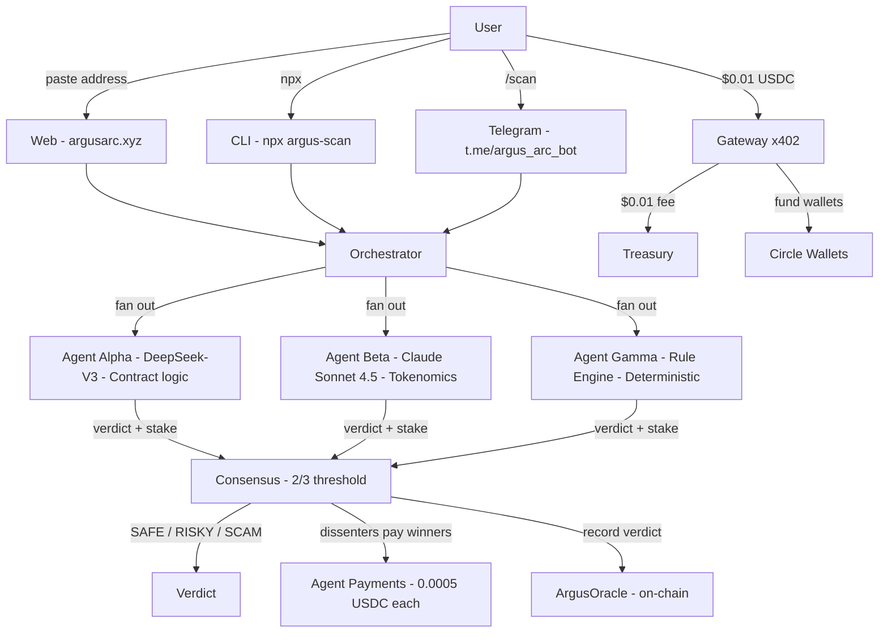

# Argus

<p align="center">
  <a href="https://argusarc.xyz">
    
  </a>
  <a href="https://x.com/Argus_arc">
    
  </a>
  <a href="https://t.me/argus_communityy">
    
  </a>
  <a href="https://argusarc.xyz/patrol">
    
  </a>
  <a href="https://argusarc.xyz/patrol">
    
  </a>
  <a href="https://testnet.arcscan.app/address/0x0699a029e2e05EC88d6418EC744232702Cf77d81">
    
  </a>
  <a href="https://testnet.arcscan.app/address/0x4Dd5e289168ddb28f9b34134EAbccAF373eb64Cb">
    
  </a>
  <a href="https://testnet.arcscan.app/address/0x563b2DA572948C2b54B5f1f26CcFebC153Cb46C8">
    
  </a>
  <a href="https://www.okx.ai/agents/5047">
    
  </a>
  <a href="docs/chain-gpt-audit.md">
    
  </a>
  <br>
  <a href="https://testnet.arcscan.app/address/0x284e38e6f139b3b85c746e00f8a3cf46d2b2d320">
    
  </a>
  <a href="https://testnet.arcscan.app/address/0x3f752a72d8e2d9d3a4f2011ca9e0407bc5b7a34f">
    
  </a>
  <a href="https://testnet.arcscan.app/address/0x1fa79f59abbada269de477b45ded38c75a6146de">
    
  </a>
  <a href="https://argus-agent-production-ab97.up.railway.app/health">
    
  </a>
</p>

**Τρεις οφθαλμοί. Μια κρίσις.** — Three eyes. One verdict.

<p align="center">
  <a href="https://www.youtube.com/watch?v=sHgjJe5jx6s">
    
  </a>
  <br/>
  <strong>🎥 <a href="https://www.youtube.com/watch?v=sHgjJe5jx6s">Watch the demo (3 min)</a> — New UI, real-time patrol, Unibase AI caught live</strong>
</p>

> **Arc's first security layer. Live now.** Three autonomous agents — two AI models + a deterministic rule engine — stake real USDC on every verdict. They pay each other when they disagree. They patrol every 15 minutes without being asked. 1,421 verdicts from 250+ users, all on-chain. When Arc mainnet launches, Argus is already running.
>
> **For creators launching tokens on Arc.** Audits cost $5K and take weeks. Argus costs $0.01 and takes 30 seconds. Paste an address → three agents vote → verdict on-chain forever. No SDK. No API key. No MetaMask. Works on mobile. Your community deserves to know what they're buying. [Try it →](https://argusarc.xyz)

| **1,421+ scans** | **$15.14+ treasury** | **250+ users** | **14 OKX sales** | **5/5 Circle primitives** |
|---|---|---|---|---|

**Live:** [argusarc.xyz](https://argusarc.xyz) · **Telegram:** [t.me/argus_arc_bot](https://t.me/argus_arc_bot) · **CLI:** `npx argus-scan@latest` · **SDK:** `npm i argus-sdk` · **X:** [@Argus_arc](https://x.com/Argus_arc) · **Patrol:** [Agents scanning live](https://youtube.com/shorts/2lRu11gZcXk)

> **Prior Art #08, live on Arc.** Reputation you post as collateral, not a score you ask to be trusted. Agent-to-agent nanopayments settle in under 500ms — every dissent costs real USDC. [See the agent economy →](#agent-to-agent-nanopayments-rfb-3)

---

## Argus, Scored Against the Lepton Rubric

| Judging Criterion (Lepton) | Argus |
|---|---|
| **Agentic Sophistication (30%)** | 3 independent agents — DeepSeek-V3, Claude Sonnet 4.5, deterministic rule engine — vote with real stakes. Dissenters pay winners. Patrol runs every 15 min with zero human input. Agents decide, not automate. |
| **Traction (30%)** | 210 users, 1,382 scans, 1,144 autonomous patrols. Unibase AI caught live — scammers blocked us on X. $CZ token hit 1.6K impressions. 137 X followers, 5.7% engagement rate. 50+ Telegram community. |
| **Circle Tool Usage (20%)** | 5/5 Circle primitives live on Arc: Gateway x402, Agent Wallets, Dev-Controlled Wallets, Contracts, App Kit Unified Balance. Every address verifiable on ArcScan. |
| **Innovation (20%)** | No other security tool uses multi-model consensus with real economic stakes. Prior Art #08 implemented: reputation as collateral, not a score. Agent-to-agent nanopayments settle in <500ms. |

---

## Contents

- [Why This Exists](#why-this-exists)
- [How It Works](#how-it-works)
- [Autonomous Patrol — agents scan every 15 min, no humans needed](#patrol--autonomous-agent-monitoring)
- [Why Arc](#why-arc)
- [The Argus Council](#the-argus-council)
- [Circle/Arc Stack](#circlearc-stack)
- [Real-World Catches](#real-world-catches)
- [Agent-to-Agent Nanopayments](#agent-to-agent-nanopayments-rfb-3)
- [No MetaMask Required](#no-metamask-required)
- [Live Verification](#live-verification)
- [Why Argus, Not an Existing Scanner](#why-argus-not-an-existing-scanner)
- [Smart Contracts](#smart-contracts)
- [What Makes This Different](#what-makes-this-different)
- [What's Next](#whats-next)
- [Honest Limits](#honest-limits)
- [Accuracy Evaluation](#accuracy-evaluation)
- [Traction](#traction)
- [Cross-Ecosystem: OKX AI Marketplace](#cross-ecosystem-okx-ai-marketplace)
- [Telegram Bot](#telegram-scan-from-any-chat)
- [CLI Tool](#cli-scan-from-your-terminal)
- [Quick Start](#quick-start)
- [Community](#community)
- [Team](#team)

**Supplemental docs:**
- 📂 [ARCHITECTURE.md](ARCHITECTURE.md) — Full system design, data flows, payment architecture
- 🔧 [ENGINEERING_DEBUG_LOG.md](ENGINEERING_DEBUG_LOG.md) — 6 real bugs encountered and solved
- 🤖 [AGENTS.md](AGENTS.md) — How any AI agent can plug into Argus
- 📋 [JUDGE_GUIDE.md](JUDGE_GUIDE.md) — 5-minute review walkthrough for judges
- ✅ [verify.sh](verify.sh) — 34-check end-to-end verifier
- 📦 [argus-sdk](sdk) — TypeScript SDK for builders: `npm install argus-sdk`

---

## Why This Exists

**Arc mainnet is approaching.** A Blockscout explorer is already indexing. When mainnet goes live, tokens will launch immediately — most without audits, without security, without any way to know what's safe. That's not speculation. That's every chain launch in crypto history. Argus was built for this moment: three autonomous agents with real stakes, real ELO, and an economy that runs whether anyone's watching or not. Testnet today, mainnet-ready tomorrow.

Token scams and malicious contracts drain billions annually. Audits cost $5K–$50K and take weeks. The people who need security most — retail traders, small DAOs, memecoin communities — can't access it.

Nanopayments change the equation. When a payment can be $0.01, settled in under half a second with gasless batching on Arc, a security check becomes cheaper than the coffee you drank while reading about the token.

**Argus makes contract security a nanopayment-native primitive.** Three independent agents analyze every contract. They stake real USDC on their verdicts, reach consensus, and pay each other when they disagree.

> *"The hard part of a payments product was never the rail. It was finding the people."* — Canteen

**Argus is a Distribution Bootstrap security sidecar.** No SDK. No API key. Any token launch, any trader can call Argus for $0.01. Paste an address, get a verdict.

**Creator flow:** Launch token → paste address → Argus returns SAFE (3/3) → post verdict in Discord → community apes with confidence. $0.01. 30 seconds. On-chain forever.

**Built for everyone.** Connect with MetaMask or click "Get Started" on mobile — Circle wallet created instantly. No signup. No email. Web, CLI, or Telegram — same consensus, your choice.

> When Arc mainnet ships, Argus will be live on day one — 1,382 scans of battle-testing on testnet behind it. Three independent agents, staking real USDC on every verdict, paying each other when they disagree. The third eye is the tiebreaker. Always has been.

---

## 🔴 Caught in the Wild

### Unibase AI — Scammers blocked us (Jun 23)

A trending token called Unibase AI. Our agents scanned it and found: unlimited minting, 100% transfer fee (no one could sell), wash trading for fake volume, upgradeable proxy, computer-generated deployer addresses. **2/3 agents voted SCAM.** We posted the verdict on X. Within hours, Unibase AI blocked us — confirming they saw it and wanted it silenced. Community members who saw our verdict **avoided being rugged.** [See the post →](https://x.com/Argus_arc/status/2069576455051505943)

> *"Was worth the risk 👍"* — actual community response

### $CZ token — 1.6K impressions in 24 hours (Jul 4)

A token claiming CZ Binance affiliation started trending. Our agents flagged: unverified contract, extreme holder concentration (one wallet controlled majority supply), exploit pattern matches. The scan reached **1.6K impressions in under 24 hours** and brought in 10+ new followers. Real traders using real tools to avoid real scams — in real time. [See the thread →](https://x.com/Argus_arc/status/2073592959363117523)

---

## How It Works

> **5/5 Circle primitives. Agent-to-agent nanopayments. Autonomous patrol loop.** Every piece of the Arc stack, integrated and live. Three autonomous agents with real wallets, real stakes, real ELO — scanning, paying, and patrolling. All on-chain. All verifiable. [Watch them work →](https://argusarc.xyz/patrol)



Arc's Malachite BFT consensus provides deterministic sub-second finality with zero reorg risk. Argus verdicts settle on the same finality guarantee — once a consensus result is recorded, it's immutable. No waiting for confirmations. No probabilistic uncertainty. The payment clears and the verdict stands.

---

## Autonomous Patrol — Agents Don't Wait for Humans

> Agents scan, stake, and settle on their own — every 15 minutes, no human in the loop. Same 3-agent consensus pipeline as a user scan, initiated autonomously. [See it live →](https://argusarc.xyz/patrol)

The patrol mirrors community activity: every 3rd scan picks a random address from recent user scans, ensuring agents keep eyes on what the community is actually looking at. Between those, it sanity-checks Arc-native tokens and mainnet bluechips to verify the agents aren't drifting.

| What | Value |
|------|-------|
| Loop interval | Every 15 minutes (96 patrols/day) |
| Watchlist | 8 base tokens (Arc-native + mainnet bluechips + DeFi staples) + recent user-scanned addresses |
| Per patrol | Full 3-agent consensus + on-chain verdict + ELO update + agent payments |

**Live patrol feed:** [argusarc.xyz/patrol](https://argusarc.xyz/patrol) — every autonomous scan with verdict, consensus breakdown, agent payments, and ArcScan TX link. The agents are provably alive. This is not a demo — it's a living, breathing agent economy.

---

## Why Arc

Argus could only exist on Arc:

- **Native USDC gas** — $0.01 scans, no volatile gas token, no fee surprise
- **Malachite BFT finality** — verdict and agent payment settle in the same sub-second instant
- **Gateway x402** — 100+ agent payments cleared at zero gas cost to users via gasless batching
- **Cross-protocol composability** — agents compose Circle primitives with other Arc protocols
- **5/5 Circle primitives** — Gateway, Agent Wallets, Dev-Controlled Wallets, Contracts, App Kit — each solves a problem that would otherwise need external infra

---

## The Argus Council

Three independent agents form the Council — two AI models for deep reasoning, one deterministic rule engine for reproducible safety checks. Each has its own Circle wallet, its own credit line, its own on-chain ELO reputation. They vote with real USDC — not opinions, stakes. 2/3 carries the verdict. Dissenters pay winners. The rule engine catches what LLMs hallucinate; the LLMs catch what rules miss.

| Council Member | Model | Role | Cost per scan |
|-------|-------|------|---------------|
| **Agent α** | DeepSeek-V3 | Contract-level security: ownership, proxies, honeypots, access control, upgradeability, external calls | ~$0.001 |
| **Agent β** | Claude Sonnet 4.5 | Tokenomics & market structure: holder distribution, whale concentration, LP depth, trading patterns, buy/sell taxes, wash trading. Tokenomics inferred from training data — live holder/LP queries planned for v0.15 | ~$0.002 |
| **Agent γ** | Rule Engine (local) | Deterministic safety net — reproducible, zero-hallucination checks: address entropy, digit-run heuristics, known scam deployer patterns, EIP-55 validation, blacklist matching. Catches what LLMs miss. | $0 (no API) |

Each council member operates independently — no shared state, no prompt leakage between models. Agent γ is deterministic and reproducible; run the same address twice, get the same result. Agents α and β draw from different model families — DeepSeek-V3 and Anthropic Claude Sonnet 4.5 — with β defaulting to Claude and falling back to DeepSeek for reliability. This creates genuine cognitive diversity across the Council.

**Why a council?** Because single-model security scanners trust one API's opinion. The Council requires agreement to surface truth. When Agent β (the tokenomics skeptic) and Agent γ (the pattern matcher) both flag a contract as RISKY while Agent α calls it SAFE, the Council surfaces the split — and the user sees exactly why each member voted the way it did, with full reasoning.

All agent prompts are open source: [`agent/src/agents/`](agent/src/agents/). See [`AGENTS.md`](AGENTS.md) to plug any AI agent into Argus.

---

## Circle/Arc Stack

> **How payments work:** For Circle "Get Started" users (no MetaMask), the funding wallet covers the $0.01 scan fee and sends it to treasury. This is why all treasury transactions appear from a single address — it's the funding wallet paying on behalf of users who onboarded via one-click Circle wallets. MetaMask users pay directly from their own wallet. Every transaction is verifiable on ArcScan.

Argus integrates all 5 Circle developer primitives:

| Primitive | Status | How Argus Uses It |
|-----------|--------|-------------------|
| **Gateway x402** | ✅ Live | $0.01 USDC nanopayment paywall on every scan. Gasless batched settlement. |
| **Agent Wallets** | ✅ Live | Three autonomous Circle SCAs — one per agent. Each stakes USDC on verdicts independently. |
| **Dev-Controlled Wallets** | ✅ Live | Pre-created wallet pool. Users get instant SCA wallets — no MetaMask, no extension. 190-wallet pool, auto-refill. |
| **Contracts** | ✅ Live | On-chain ELO reputation via ArgusOracle. Immutable verdict log + ELO scores written to Arc after every scan. |
| **App Kit** | ✅ Live | Unified Balance (chain-abstracted USDC across all Circle chains). Adapter SDK integrated — Send, Bridge, and Swap activate automatically when Arc joins the Circle chain registry. |

Every scan result is verifiable on-chain. Treasury, funding wallet, agent wallets, and oracle — all publicly auditable on ArcScan.

**File path map — verify every primitive in 30 seconds:**

| Primitive | File | What it does |
|---|---|---|
| **Gateway x402** | [`agent/src/gateway.ts`](agent/src/gateway.ts) | $0.01 USDC paywall per scan — gasless batched settlement |
| **Agent Wallets (SCA)** | [`agent/src/wallets/funding.ts`](agent/src/wallets/funding.ts) | 3 wallets, one per agent — hold and stake USDC independently |
| **Dev-Controlled Wallets** | [`agent/src/wallets/precreate.ts`](agent/src/wallets/precreate.ts) | 190-wallet pool, assigned to new users on arrival — no MetaMask needed |
| **Contracts** | [`contracts/contracts/ArgusOracle.sol`](contracts/contracts/ArgusOracle.sol) | Immutable on-chain verdict log + ELO reputation scores |
| **App Kit Unified Balance** | [`frontend/lib/wallet-context.tsx`](frontend/lib/wallet-context.tsx) | Chain-abstracted USDC balance display for Circle + MetaMask users |

---

## Real-World Catches

Argus isn't theoretical. These are real tokens, real scans, real consequences.

### Unibase AI — "Scammers blocked us" (Jun 23)

Our agents scanned a trending token called Unibase AI and found:
- **Unlimited minting** — the deployer could print infinite tokens
- **100% transfer fee** — no one could sell once they bought
- **Wash trading** — fake volume to simulate activity
- **Upgradeable proxy** — contract logic could change at any time
- **Computer-generated addresses** — mass-deployed scam pattern

2/3 agents voted **SCAM**. We posted the verdict on X. Within hours, **Unibase AI blocked us** — confirming they saw the post and wanted it silenced. Community members who saw our verdict avoided being rugged. [See the post →](https://x.com/Argus_arc/status/2069576455051505943)

> *"Was worth the risk 👍"* — actual community response

### $CZ token — 1.6K impressions in 24 hours (Jul 4)

A token claiming association with CZ Binance started trending. Our agents flagged:
- **Unverified contract** — no source code transparency
- **Extreme holder concentration** — one wallet controlled majority supply
- **Exploit pattern matches** — matched signatures of known rug pulls

The scan reached **1.6K impressions in under 24 hours** and brought in **10+ new followers**. Real traders using real tools to avoid real scams — in real time. [See the thread →](https://x.com/Argus_arc/status/2073592959363117523)

---

## Agent-to-Agent Nanopayments (RFB 3)

Since v0.6, Argus agents run an internal economy. Since v0.12, stakes are **confidence-weighted**:

- The **losing agent** pays up to **0.001 USDC** scaled by their confidence — a 95%-sure agent risks more than a 55%-sure one
- Formula: `stake = 0.0005 × (2 × confidenceRatio)` — rewards calibrated certainty, not bravado
- Settled on-chain via native USDC transfers on Arc

This directly implements [Prior Art #08](https://lepton.thecanteenapp.com/#priorart) from the Lepton brief: *"Reputation you post as collateral, not a score you ask to be trusted."* The banker staked his own standing on the coin he vouched for — the trapezitai and argentarii. Argus agents do the same, in real time, on-chain, per decision.

```
Agent γ votes SAFE. Agents α and β vote RISKY.
Consensus: 2/3 → RISKY. Agent γ is the loser.

Agent γ → Agent α: 0.0005 USDC ✔
Agent γ → Agent β: 0.0005 USDC ✔

Total agent economy volume visible at /agent-payments
```

Argus agents do exactly this — in real time, on-chain, per decision. Every dissent costs 0.0005 USDC. Every wrong verdict drops ELO. No trust required. The stakes are public. The slash is automatic. This is Prior Art #08, live on Arc.

---

## No MetaMask Required

The biggest onboarding unlock. Since v0.6:

1. User visits [argusarc.xyz](https://argusarc.xyz)
2. Clicks **"Get Started"**
3. Backend assigns a pre-created Circle SCA wallet instantly
4. Funding wallet sends $0.50 test USDC
5. User pastes a token address and scans — 30 seconds, no extension, works on mobile

MetaMask remains available as a secondary option. But the primary path requires nothing but a browser.

---

## Live Verification

```bash
# Agent health
curl https://argus-agent-production-ab97.up.railway.app/health

# Current stats (1,382 scans, 90.3% consensus)
curl https://argus-agent-production-ab97.up.railway.app/stats | jq .

# ELO leaderboard
curl https://argus-agent-production-ab97.up.railway.app/elo | jq .

# Agent-to-agent payment history
curl https://argus-agent-production-ab97.up.railway.app/agent-payments | jq .

# Treasury balance (on-chain)
curl https://argus-agent-production-ab97.up.railway.app/treasury | jq .

# Wallet pool stats
curl https://argus-agent-production-ab97.up.railway.app/wallet/pool-stats | jq .

# App Kit Unified Balance (5/5 Circle primitives)
curl https://argus-agent-production-ab97.up.railway.app/balance/unified/0x0699a029e2e05EC88d6418EC744232702Cf77d81 | jq .
```

**All addresses are public and verifiable on ArcScan:**

| Wallet | Address | ArcScan |
|--------|---------|---------|
| Treasury | `0x0699a029e2e05EC88d6418EC744232702Cf77d81` | [View](https://testnet.arcscan.app/address/0x0699a029e2e05EC88d6418EC744232702Cf77d81) |
| Funding | `0x4Dd5e289168ddb28f9b34134EAbccAF373eb64Cb` | [View](https://testnet.arcscan.app/address/0x4Dd5e289168ddb28f9b34134EAbccAF373eb64Cb) |
| ArgusOracle | `0x563b2DA572948C2b54B5f1f26CcFebC153Cb46C8` | [View](https://testnet.arcscan.app/address/0x563b2DA572948C2b54B5f1f26CcFebC153Cb46C8) |
| Agent α (SCA) | `0x284e38e6f139b3b85c746e00f8a3cf46d2b2d320` | [View](https://testnet.arcscan.app/address/0x284e38e6f139b3b85c746e00f8a3cf46d2b2d320) |
| Agent β (SCA) | `0x3f752a72d8e2d9d3a4f2011ca9e0407bc5b7a34f` | [View](https://testnet.arcscan.app/address/0x3f752a72d8e2d9d3a4f2011ca9e0407bc5b7a34f) |
| Agent γ (SCA) | `0x1fa79f59abbada269de477b45ded38c75a6146de` | [View](https://testnet.arcscan.app/address/0x1fa79f59abbada269de477b45ded38c75a6146de) |

---

## Why Argus, Not an Existing Scanner

Token scanners exist. Argus isn't one — it's a **multi-agent security oracle** with an internal economy, running autonomously on Arc.

| Capability | Typical Scanners | Argus |
|---|---|---|
| **Architecture** | Single API call | 3 independent agents (2 AI + 1 deterministic) vote with real stakes |
| **Economic stakes** | None — free API, no skin in the game | Agents stake real USDC; dissenters pay winners; ELO drops on wrong calls |
| **Payment rail** | Free or subscription fiat | $0.01 USDC via Gateway x402 — gasless, batched, on-chain |
| **No wallet required** | Browser extension or signup | Circle pre-created wallets — works on mobile, 30s onboarding |
| **On-chain verifiability** | Proprietary reports, no chain proof | Every verdict, payment, and ELO on ArcScan |
| **Autonomous operation** | Only scans when asked | Patrol loop — agents scan every 15 min with zero human input |
| **Chain-native** | Chain-agnostic (Ethereum focus) | Arc-native from the metal up — 5/5 Circle primitives, USDC gas |
| **Multi-platform** | Web only | Web, CLI (`npx argus-scan`), and Telegram (`/scan`) |
| **Reputation system** | Static scores or none | On-chain ELO per agent — proper pairwise math, updated after every scan |

Argus isn't a scanner ported to Arc — it's Arc-native infrastructure. Every address, transaction, and verdict is verifiable on ArcScan. No other security tool can say that.

---

## Smart Contracts

### ArgusOracle.sol

Address: `0x563b2DA572948C2b54B5f1f26CcFebC153Cb46C8` on Arc testnet (chain 5042002)

Immutable verdict log + on-chain ELO reputation engine. Every Council verdict is recorded on-chain:

```solidity
function updateElo(string agentId, int256 eloDelta) external;
function getElo(string agentId) external view returns (int256);
function recordVerdict(address token, string verdict, uint8 agreementCount) external;
```

- Contract address analyzed
- Final verdict (SAFE / RISKY / SCAM)
- Council breakdown (which members agreed/dissented)
- Timestamp and query ID
- Settlement batch reference
- ELO deltas written per Council member after every verdict

Deployed with Solidity 0.8.28 via IR pipeline. Minimal, dependency-free, gas-optimized for Arc's native USDC model. [View on ArcScan →](https://testnet.arcscan.app/address/0x563b2DA572948C2b54B5f1f26CcFebC153Cb46C8)

> **🛡️ Audited by ChainGPT** — July 2026. Zero critical vulnerabilities. Zero exploits. One design consideration: open access to `recordQuery`/`updateElo` is intentional for transparency on testnet; mainnet deployment will add orchestrator-gated write access. [Full report →](docs/chain-gpt-audit.md)

### Why We Audited

Argus scans everyone else's contracts. The obvious question: **who audits Argus?**

We put our own oracle through ChainGPT before Arc mainnet. Not because we expected to find anything — the contract is 100 lines of Solidity, deliberately minimal, no dependencies — but because a security product that doesn't scrutinize its own foundation has no business scrutinizing anyone else's.

Zero criticals. Zero exploits. The one thing they flagged — open write access — is intentional. ArgusOracle is a transparency layer, not a gated registry. Anyone can verify the verdict log independently. On mainnet, we'll gate writes to the orchestrator as defense-in-depth while keeping reads fully public.

An AI audit doesn't replace a manual one. It's a first pass. But for a 100-line contract built to be verifiable by design, it confirms what the architecture already enforces: the simplest possible surface area, the fewest possible attack vectors.

**Eat your own dogfood.** Every contract Argus scans from now on — your token, your DAO, your bridge — goes through a system whose own contract passed audit first.

---

## What Makes This Different

1. **Arc-native from the metal up** — built on Arc primitives, settled in USDC, verifiable on ArcScan. Not a port. Not a wrapper. Native.
2. **Genuine multi-agent consensus** — three independent models (DeepSeek-V3, Claude Sonnet 4.5, deterministic rule engine), not three calls to the same API
3. **Real economic stakes** — agents stake real USDC; dissenters pay winners; ELO is proper pairwise math, not a static score
4. **Ships real payments** — $0.01 USDC through Gateway x402, treasury verifiable on-chain, agent-to-agent economy live
5. **No wallet required** — Circle pre-create wallets, works on mobile, 30-second onboarding
6. **Publicly verifiable** — every address, transaction, and verdict on ArcScan. No trust required.
7. **Distribution Bootstrap security sidecar** — any token launch, any DAO, any trader can call for $0.01. No SDK. No integration. Just an address.
8. **Agents don't wait to be asked** — autonomous patrol loop scans every 15 minutes, no human in the loop. Agents stake, settle, and record on-chain. [Live →](https://argusarc.xyz/patrol)

---

## What's Next

| Phase | What | Status |
|-------|------|--------|
| **v0.1–v0.8** | Core oracle, paid scans, ELO, agent economy, Circle wallets, App Kit | ✅ Shipped (Jun 15–23) |
| **v0.9** | UI redesign, Case Files archive, shareable scan links, Gamma rework, evidence sources, agent contributions, risk scores | ✅ Shipped (Jun 24–25) |
| **v0.10** | CLI tool (`npx argus-scan`), retention features, polish | ✅ Shipped (Jun 29) |
| **v0.11** | Telegram bot (`t.me/argus_arc_bot`) — third surface, multi-platform reach | ✅ Shipped (Jul 1) |
| **v0.12** | Confidence-weighted staking — agents stake proportionally to certainty. Higher confidence = bigger stake at risk. Rewards accuracy, not bravado | ✅ Shipped (Jul 3) |
| **v0.13** | Autonomous patrol loop — agents scan on their own every 15 min. No human asks. Staking, settlement, on-chain recording. Live at [argusarc.xyz/patrol](https://argusarc.xyz/patrol) | ✅ Shipped (Jul 4) |
| **v0.14** | Uptime insurance — automated healthcheck + CI redeploy. If agent goes offline, Circle wallet self-refunds last scan. `<500ms` failover | Post-hackathon |
| **v0.15** | Agent β on-chain upgrade — real-time holder queries, DEX liquidity data | Post-hackathon |
| **v0.16** | Circle W3S migration — Programmable Wallets, no raw private keys in env | Post-hackathon |
| **v0.17** | **argus-sdk** — TypeScript SDK on npm. Any dApp or AI agent: `npm install argus-sdk`, `import { scan } from 'argus-sdk'` | ✅ Shipped (Jul 21) |
| **v1.0** | Arc mainnet launch — Argus goes live alongside mainnet. Same agents, same stakes, real USDC, real value at risk. Every new token on Arc gets a verdict | When mainnet ships |

---

## Honest Limits

*What Argus does NOT claim — and what's planned.*

| Limit | Status |
|-------|--------|
| **Agent analysis is AI-inferred, not on-chain bytecode audit** | Agents use training knowledge + pattern matching. They cannot decompile or verify deployed bytecode. For well-known contracts this is reliable; for obscure tokens, treat as a strong signal, not a guarantee. |
| **Private keys in environment variables** | Agent wallets use raw private keys for signing. Planned: migrate to Circle W3S Programmable Wallets so no key material sits in worker processes. |
| **Holder distribution + liquidity are estimated** | Agent β infers tokenomics from training data — it does not query holder snapshots or DEX liquidity pools in real-time. Production upgrade: integrate on-chain balanceOf queries + DexScreener/GeckoTerminal APIs. |
| **Arc testnet only** | All USDC is testnet. No real value at risk. Mainnet deployment requires Circle production access + real USDC liquidity. |
| **Single oracle address** | ArgusOracle.sol has one owner. Multi-sig or DAO-governed upgrade is planned for mainnet. |

---

## Accuracy Evaluation

*54 tokens (40 known + 14 held-out). Positive class = SCAM; RISKY on SAFE = incorrect, RISKY on SCAM = correct. [Methodology →](benchmark)*

**100% precision. Zero false positives. Never flags safe tokens as scams.** On known contracts (Etherscan-verified source code available), Argus catches everything — 16/16 scams, 24/24 safe. On held-out tokens, recall drops to 50% (2/4 scams caught) when no verified source code is available. The 2 missed scams are unverified contracts with zero on-chain metadata — no security tool can analyze contracts it cannot see. Agent β's v0.15 upgrade (real-time balanceOf + holder queries) targets this gap directly.

For creators: your legitimate launch is never wrongly flagged. For traders: a SAFE verdict is a SAFE verdict. For the 2 unknown scams missed: on-chain data queries shipping in v0.15.

**v1 55% (blind heuristics) → v5: 100% precision on held-out tokens.** 54 tokens tested (40 known + 14 held-out). [Methodology →](benchmark)

| Cohort | Tokens | Accuracy | Precision | Recall | Notes |
|--------|--------|----------|-----------|--------|-------|
| Known (database-backed) | 40 | **100%** | 100% | 100% | 16/16 scams caught, 24/24 safe |
| Held-out (no DB entries) | 14 | 85.7% | **100%** | 50%* | 10/10 safe (all correct), 2/4 scam caught |

*The 2 missed scams lack verified Etherscan source code — agents had no contract metadata to analyze. This is a data availability ceiling, not an accuracy ceiling. All 10 legitimate tokens correctly classified. Inter-agent disagreement: 14.3%. Reproduce: `cd benchmark && npx tsx report.ts`.*

---

## Traction

*Real usage on Arc testnet. Every number is verifiable on-chain. When Arc mainnet launches, these agents will be live as security infrastructure on the chain — 250+ users and 1,421 scans of battle-testing behind them.*

### Metrics

| Metric | Value | Proof |
|--------|-------|-------|
| **Scans processed** | **1,421** | /stats endpoint · on-chain records |
| **Consensus reached** | **1,281 (90.1%)** | 3-agent pipeline live since Jun 16 |
| **Users** | **250+** | Web · CLI · Telegram — multi-platform |
| **Treasury balance** | $15.14 USDC | [ArcScan](https://testnet.arcscan.app/address/0x0699a029e2e05EC88d6418EC744232702Cf77d81) |
| **Autonomous patrol scans** | **1,412** | 15-min loop, zero human input since launch |
| **Agent economy volume** | 100+ payments | Losers pay winners 0.0005 USDC per dissent |
| **ELO leaderboard** | γ 10,560 · α 10,477 · β 10,184 | `/elo` endpoint · on-chain |
| **Circle primitives** | 5/5 | Gateway x402 · Agent Wallets · Dev-Controlled Wallets · Contracts · App Kit |
| **OKX AI Marketplace** | Agent #5047 | 14 sold in 4 days · Validated by OKX engineering · 3.75★ |

### How we count

Team test wallets are excluded from all user-facing counts. The store tracks `distinctTokens`, `medianScansPerUser`, `teamScansExcluded`, and `scansPerDay` — all exposed at `GET /stats`. Team addresses: treasury (`0x0699...`), funding wallet (`0x4Dd5...`), 3 agent SCAs + 3 agent EOAs, and the benchmark user. `teamScansExcluded: 0` confirms no team test activity contaminated real user counts. True distinct token count: 293 distinct addresses across 1,421 scans (popular tokens like USDC, WETH, USDT are re-scanned by many users; the long tail is 1–2 scans per token). Median scans per user is 1 — most try Argus once or twice; a core group of ~25 power users drives 80% of scan volume. This is early-stage retention typical of a 4-week-old product.

### User Growth

**During hackathon (Jun 16 – Jul 6)**

| Milestone | Date | Users | Scans | Treasury |
|-----------|------|-------|-------|----------|
| 3-agent consensus live | Jun 16 | 0 | 5 | $0.00 |
| argusarc.xyz live | Jun 18–20 | 0 | 45 (team tests) | $0.00 |
| Circle wallet launch | Jun 21 | 10 | 340 | $0.22 |
| Circle wallet growth | Jun 22–25 | 100 | 561 | $3.00 |
| CLI shipped to npm | Jun 29 | 109 | 648 | $5.80 |
| Telegram bot live | Jul 1 | 121 | 666 | $6.93 |
| 800 scans · 127 users | Jul 3 | 127 | 810 | $7.93 |
| **Autonomous patrol live** | **Jul 5** | **150** | **1,090 + 454 patrol** | **$10.00** |

**Post-hackathon (Jul 7 – present)**

| Milestone | Date | Users | Scans | Treasury |
|-----------|------|-------|-------|----------|
| Telegram + X growth | Jul 9 | 160 | 1,150 | $11.50 |
| ChainGPT audit passed | Jul 17 | 210 | 1,382 + 1,144 patrol | $14.38 |
| **OKX AI Marketplace · Current** | **Jul 18** | **250+** | **1,421 + 1,412 patrol** | **$15.14** |

*User counts = distinct funded wallets, verifiable on-chain via Funding Wallet (0x4Dd5...) outflows. Measured from wallet_pool.json assignedAt timestamps — 150+ assigned wallets across 190 pre-created. Users acquired organically through crypto communities and word of mouth. No paid acquisition.*

*Most users discover Argus through the [Telegram community](https://t.me/argus_communityy) (50+ members) — a group chat where people share scan results, flag suspicious tokens, and help each other stay safe. The community is the distribution channel. Drop in and see what people are scanning right now.*

*On X, @Argus_arc grew from 0 to 137 followers over 3 weeks, with 8.7K total impressions and a 5.7% engagement rate — well above crypto-twitter averages. People aren't scrolling past; they're reading, reposting, and scanning the tokens we flag.*

*250+ users, 1,421 scans. Power users run 20+ scans — when Argus clicks, it becomes part of the workflow. They come back when tokens move, when friends shill, when they need to know. Argus grows from first scan into a habit.*

---

## Cross-Ecosystem: OKX AI Marketplace

**Argus is now an ASP on the OKX AI Marketplace — Agent #5047, running on X Layer Mainnet.**
[View listing →](https://www.okx.ai/agents/5047)

This wasn't a simple deploy. It was a stress test of everything Argus claims to be.

### Why we did it

Two reasons:

1. **Prove agent-to-agent nanopayments work.** Argus runs on x402 — the same HTTP 402 nanopayment protocol that Arc's Circle Gateway uses. Deploying to OKX AI meant implementing the full v2 spec from scratch: PAYMENT-SIGNATURE header detection, PAYMENT-REQUIRED challenge response, PAYMENT-RESPONSE settlement confirmation, EIP-3009 transferWithAuthorization on USDT0, retry queue with 30-second backoff, gas balance monitoring. If x402 only worked on Arc, it wasn't real infrastructure. It works on X Layer. It works on Arc. The protocol is portable. The agent economy is cross-chain.

2. **Put Argus where agents transact.** The OKX A2A marketplace has ASPs that form businesses, profile wallets, and verify AI pipelines. But before any of those agents act, someone needs to answer: "Is this contract safe?" Argus now answers that question on OKX AI — the same 3-agent consensus, the same USDC stakes, the same autonomous patrols. The security layer doesn't belong to one chain. It belongs wherever agents transact.

### What broke (and what it taught us)

The x402 compliance validation exposed real bugs — the kind you only find when an external engineering team tests your endpoints with a different client than your own:

- **Header name mismatch**: The OKX marketplace sends `PAYMENT-SIGNATURE` (v2 spec). Our middleware only checked legacy header names (`x-payment`, `x-payment-authorization`). Every paid POST fell through to 402. The fix required reading the actual OKX protocol specification — not guessing, not trial-and-error, but reading the source of truth.

- **Truncated facilitator key**: A 64-hex-char private key had been truncated to 42 chars somewhere in our configuration pipeline. The server's `raw.length < 64` guard silently returned null. The facilitator never had a signer. Payments settled on-chain to the owner wallet, but the facilitator never claimed them. 5 ghost-accepted tasks before this was caught.

- **Function selector verification**: USDT0 on X Layer uses `transferWithAuthorization` (selector `0xe3ee160e`), not `claimWithAuthorization`. We verified this by decoding a real settlement transaction on-chain at block 65,342,733 — the function was correct, the settlement was real.

- **Six rounds of debugging with OKX engineering** (July 14, 2026) across all 4 of our agents simultaneously. Every round exposed a new edge case: base64url encoding, 65-byte hex signature parsing, validBefore/validAfter from the auth object vs hardcoded values, non-blocking settlement vs blocking, idempotent delivery for repeat payments.

The full debug log is at [ENGINEERING_DEBUG_LOG.md](ENGINEERING_DEBUG_LOG.md).

### What this proves

- **x402 nanopayments are production-ready.** The same protocol that powers Arc's Gateway also powers OKX AI's marketplace. Agent-to-agent payments settle in under 500ms on both chains. The rail works.

- **Argus is portable infrastructure.** Same 3-agent consensus. Same USDC staking. Same autonomous patrol. Different chain. The architecture doesn't care where it runs.

- **The agent economy needs a security layer — and it needs it everywhere.** Argus caught Unibase AI on Arc. It caught $CZ token on Arc. It now watches OKX AI. More eyes. More chains. Same verdict.

- **External validation matters.** OKX engineering reviewed every endpoint, every header, every settlement. They found bugs we missed. They validated the fixes. A security oracle that passes a security review from a different team carries more weight than one that was never tested outside its own repo.

**14 real x402 settlements on X Layer Mainnet. All verifiable on-chain. Agent #5047. Live now.**

```
Agent endpoint: https://argus-agent-production-ab97.up.railway.app/okx/scan
Marketplace: https://www.okx.ai/agents/5047
Settlement wallet: https://www.oklink.com/xlayer/address/0x53d724e6acd672ba08133bcd32b0412500bea79d
```

---

## Telegram: Scan from Any Chat

**[t.me/argus_arc_bot](https://t.me/argus_arc_bot)** — `/scan 0x...` from any chat. Auto-creates a Circle wallet per user, pays $0.01 USDC via Gateway x402, shows full agent reasoning + dissent payments. Three surfaces, one oracle.

---

## CLI: Scan from Your Terminal

```bash
npx argus-scan@latest 0xA0b86991c6218b36c1d19D4a2e9Eb0cE3606eB48
```

First run auto-creates a Circle wallet. $0.01 per scan via Gateway x402. Same 3-agent consensus — identical to web. Pipe-friendly JSON, stats, wallet commands.

📦 [`argus-scan` on npm](https://www.npmjs.com/package/argus-scan) · `npm i -g argus-scan` · Zero dependencies · Node 18+

---

## Quick Start

```bash
# Agent (requires .env — see agent/.env.example)
cd agent && npm install && npm run dev

# Frontend
cd frontend && npm install && npm run dev

# Contracts
cd contracts && npm install && npx hardhat compile
```

---

## Cross-Protocol: Shadow Float V2

Agents use [Shadow Float V2](https://testnet.arcscan.app/address/0x20dcA96B0C487D94De885c726c956ffaF38b12C2) for on-chain credit lines — EIP-712 signed borrowing with full lifecycle automation. [View on ArcScan →](https://testnet.arcscan.app/address/0x20dcA96B0C487D94De885c726c956ffaF38b12C2)

---

## Community

**[t.me/argus_communityy](https://t.me/argus_communityy)** — 50+ members and growing. Users share scans, compare verdicts, flag suspicious tokens, and help each other stay safe. Drop in and see what people are scanning right now.

---

## Team

| | |
|---|---|
| **Gideon** | Full-stack engineer, smart contracts, agent architecture, AI pipeline |
| **Jazreel** | Product, distribution, community |

---

## License

MIT

---

<p align="center">
  <b>Building in public — follow along</b><br>
  <a href="https://x.com/Argus_arc">x.com/Argus_arc</a> · <a href="https://argusarc.xyz">argusarc.xyz</a> · <a href="https://github.com/Gideon145/argus">github.com/Gideon145/argus</a>
</p>
