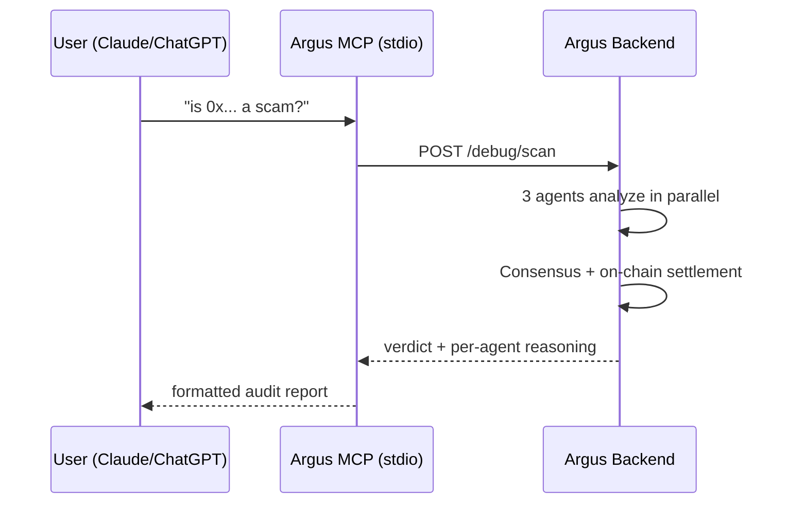

# Argus MCP — Multi-Agent Security Oracle

**Ask any AI to audit any smart contract.** Argus runs three independent AI agents — **Agent-α (DeepSeek-V3)** on contract logic, **Agent-β (Claude)** on tokenomics, **Agent-γ (rules engine)** on deterministic checks — and returns a consensus verdict (SAFE / RISKY / SCAM) with per-agent confidence and reasoning. Every scan settles on-chain via Circle x402.

> ⚡ Powered by the Argus Arc testnet oracle · argusarc.dev · Circle Alliance Program

## Tools

| Tool | Description |
|---|---|
| `scan_contract` | Full 3-agent consensus audit of any EVM contract address |
| `recent_scans` | Latest scans from the Argus oracle |
| `agent_elo` | Live ELO reputation leaderboard for the 3 agents |
| `pool_stats` | Platform stats — assigned user wallets, available wallets |

## Quick start with npx

```bash
npx @argus-arc/mcp
```

No build, no install — just run it. Point your MCP client at this command.

## Claude Desktop

Add to `claude_desktop_config.json` (Claude → Settings → Developer → Edit Config):

```json
{
  "mcpServers": {
    "argus": {
      "command": "npx",
      "args": ["-y", "@argus-arc/mcp"]
    }
  }
}
```

Restart Claude, then ask:

> *"Is 0xA0b86991c6218b36c1d19D4a2e9Eb0cE3606eB48 safe?"*
> *"Scan 0x675E25a39568713144905A946F8d9F74d3a7Aa79 for scams"*

Claude will call `scan_contract` and cite the 3-agent consensus verdict.

## ChatGPT (MCP Connector)

1. Open ChatGPT → your profile → **Connectors** → **MCP**
2. Add a connector of type **stdio**
3. Command: `npx`, Arguments: `-y @argus-arc/mcp`
4. Ask: *"Use Argus to scan 0x... and tell me if it's a scam"*

Works the same in **Cursor**, **Windsurf**, and any MCP-compatible client.

## Configuration

| Env var | Default | Purpose |
|---|---|---|
| `ARGUS_API_URL` | `https://argus-web-backend-production.up.railway.app` | Argus backend endpoint |

```json
{
  "mcpServers": {
    "argus": {
      "command": "npx",
      "args": ["-y", "@argus-arc/mcp"],
      "env": { "ARGUS_API_URL": "https://your-backend.example.com" }
    }
  }
}
```

## Local development

```bash
npm install
npm run build        # compile to dist/
npm test             # smoke test against live backend
npm run dev          # run from source via tsx
```

## How it works



## License

MIT
